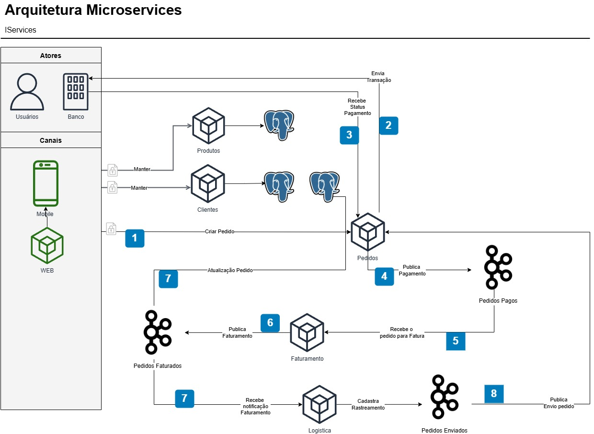

[LICENSE__BADGE]: https://img.shields.io/github/license/Fernanda-Kipper/Readme-Templates?style=for-the-badge
[JAVA_BADGE]:https://img.shields.io/badge/java-%23ED8B00.svg?style=for-the-badge&logo=openjdk&logoColor=white
[SPRING_BADGE]: https://img.shields.io/badge/spring-%236DB33F.svg?style=for-the-badge&logo=spring&logoColor=white
[POSTGRES]:https://img.shields.io/badge/postgres-%23316192.svg?style=for-the-badge&logo=postgresql&logoColor=white
[APACHE-KAFKA]:https://img.shields.io/badge/Apache%20Kafka-000?style=for-the-badge&logo=apachekafka
[MAVEN]:https://img.shields.io/badge/apachemaven-C71A36.svg?style=for-the-badge&logo=apachemaven&logoColor=white
[POSTMAN]:https://img.shields.io/badge/Postman-FF6C37?style=for-the-badge&logo=postman&logoColor=white
[DOCKER]:https://img.shields.io/badge/docker-%230db7ed.svg?style=for-the-badge&logo=docker&logoColor=white

<h1 align="center" style="font-weight: bold;">Projeto ICompras 💻</h1>

![license][LICENSE__BADGE]
![postgres][POSTGRES]
![kafka][APACHE-KAFKA]
![maven][MAVEN]
![spring][SPRING_BADGE]
![java][JAVA_BADGE]
![postman][POSTMAN]
![docker][DOCKER]

<details open="open">
<summary>📘 Índice</summary>

- [🧰 Pré-requisitos](#-pré-requisitos)
- [🐳 Serviços do Ambiente Docker](#-serviços-do-ambiente-docker)
- [🧩 Fluxo Completo do Sistema](#-fluxo-completo-do-sistema)
- [📡 API Endpoints](#-api-endpoints)
- [🤝 Colaboradores](#-colaboradores)
- [📫 Como Contribuir](#-como-contribuir)
- [📄 Licença](#-licença)

</details>

---

# 🧰 Pré-requisitos

- **Java 17+**
- **Maven 3.9+**
- **Docker**
- **Postman**

---

# 🐳 Serviços do Ambiente Docker

Dentro do diretório **`icompras-serviços`**, execute:

```bash
docker compose up -d
```

Isso iniciará automaticamente:

- Container do **PostgreSQL**
- Container do **Apache Kafka + Zookeeper e Kafka-UI (acesso por http://localhost:8090/)**
- Container do **MINIO Object Store** (onde são armazenados os PDFs das notas geradas — acesso por http://localhost:9001/login)

---

# 🧩 Fluxo Completo do Sistema

O ciclo de execução do projeto segue esta sequência:

| Etapa | Descrição |
|-------|-----------|
| 1️⃣ | **Executar o ambiente**: executar os **arquivos Docker Compose** dentro do módulo `icompras-serviços` (`docker compose up -d`). Acessar os banco de dados e executar os **scripts SQL** para criação das tabelas. |
| 2️⃣ | **Criar um Cliente**: `POST /clientes` com os dados do cliente. |
| 3️⃣ | **Criar um Produto**: `POST /produtos` com os dados do produto. |
| 4️⃣ | **Criar um Pedido**: `POST /pedidos` associando o cliente e os produtos. |
| 5️⃣ | **Obter a chave de pagamento**: consultar na base de **Pedidos** a `chavePagamento` gerada para o pedido. |
| 6️⃣ | **Executar o callback (webhook)**: chamar `POST /pedidos/callback-pagamentos` informando o `codigo`, `chavePagamento`, `status=true` e `observacoes`. |
| 7️⃣ | **Pós-pagamento**: serviços de **Faturamento** e **Logística** são acionados via Kafka, concluindo o fluxo. |

<p align="center">
    
</p>

---

# 📡 API Endpoints

## Clientes (`ClienteController`)
Base: `/clientes`

| Método | Rota | Corpo (JSON) | Descrição |
|-------:|------|--------------|-----------|
| POST | `/clientes` | `Cliente` | Cadastra um novo cliente |
| GET | `/clientes/{codigo}` | — | Consulta cliente por código |
| DELETE | `/clientes/{codigo}` | — | Inativa o cliente (não deleta físico) |

**Exemplo `Cliente`**
```json
{
  "nome": "Carlos da Silva",
  "cpf": "12345678900",
  "email": "carlos.silva@email.com",
  "endereco": "Rua das Flores, 120 - São Paulo"
}
```

---

## Produtos (`ProdutoController`)
Base: `/produtos`

| Método | Rota | Corpo (JSON) | Descrição |
|-------:|------|--------------|-----------|
| POST | `/produtos` | `Produto` | Cadastra um novo produto |
| GET | `/produtos/{codigo}` | — | Consulta produto por código |
| DELETE | `/produtos/{codigo}` | — | Inativa o produto (não deleta físico) |

**Exemplo `Produto`**
```json
{
  "nome": "Notebook Dell XPS 13",
  "descricao": "Notebook 13'' i7 16GB RAM",
  "valorUnitario": 8500.00,
  "estoque": 20
}
```

---

## Pedidos (`PedidoController`)
Base: `/pedidos`

| Método | Rota | Corpo (JSON) | Descrição |
|-------:|------|--------------|-----------|
| POST | `/pedidos` | `NovoPedidoDTO` | Cria um novo pedido |
| GET | `/pedidos/{codigo}` | — | Retorna detalhes do pedido |
| POST | `/pedidos/pagamentos` | `AdicaoNovoPagamentoDTO` | Adiciona um novo pagamento ao pedido |

**Exemplo `NovoPedidoDTO`**
```json
{
  "codigoCliente": 1,
  "dadosPagamento": {
    "metodo": "PIX"
  },
  "itens": [
    { "codigoProduto": 1, "quantidade": 1, "valorUnitario": 8500.00 }
  ]
}
```

**Exemplo `AdicaoNovoPagamentoDTO`**
```json
{
  "codigoPedido": 1058,
  "dados": "chave-pagamento-gerada-pelo-sistema",
  "tipoPagamento": "CREDIT"
}
```

---

## Callback de Pagamento (`RecebimentoCallbackPagamentoController`)
Base: `/pedidos/callback-pagamentos`

| Método | Rota | Corpo (JSON) | Descrição |
|-------:|------|--------------|-----------|
| POST | `/pedidos/callback-pagamentos` | `RecebimentoCallbackPagamentoDTO` | Webhook para atualizar status do pagamento |

**Exemplo `RecebimentoCallbackPagamentoDTO`**
```json
{
  "codigo": 1058,
  "chavePagamento": "d5c2f33b-199a-48e5-91a1-82f3bb07e9b1",
  "status": true,
  "observacoes": "Pagamento confirmado via CREDIT"
}
```

---

## Faturamento / Bucket (`BucketController`)
Base: `/bucket`

| Método | Rota | Corpo | Descrição |
|-------:|------|-------|-----------|
| POST | `/bucket` | `multipart/form-data` | Envia arquivo para o bucket |
| GET | `/bucket?filename=arquivo` | — | Retorna (redirect 301) para URL do arquivo |

---

# 🤝 Colaboradores

<table>
  <tr>
    <td align="center">
      <a href="https://www.linkedin.com/in/wepdev/">
        <br>
        <sub><b>Waldir Escouto Pereira</b></sub>
      </a><br>
      <sub>Desenvolvedor Back-end | Arquiteto de Microserviços</sub>
    </td>
  </tr>
</table>

---

# 📫 Como Contribuir

1. Faça um **fork** do projeto
2. Crie uma **branch**:
   ```bash
   git checkout -b feature/nome-da-feature
   ```
3. Realize suas alterações e **commite** seguindo o padrão convencional:
   ```bash
   git commit -m "feat: descrição da nova funcionalidade"
   ```
4. Envie um **pull request** e aguarde a revisão.

📘 Documentações úteis:
- [Como criar um Pull Request](https://www.atlassian.com/br/git/tutorials/making-a-pull-request)
- [Padrões de Commit](https://www.conventionalcommits.org/pt-br/v1.0.0/)

---

# 📄 Licença

Este projeto está sob a licença **MIT** — consulte o arquivo [LICENSE](../LICENSE) para mais detalhes.

---

### 🧠 Autor
Desenvolvido com 💙 por **Waldir Escouto Pereira**  
📍 Rio de Janeiro - Brasil  
🔗 [LinkedIn](https://www.linkedin.com/in/wepdev)
